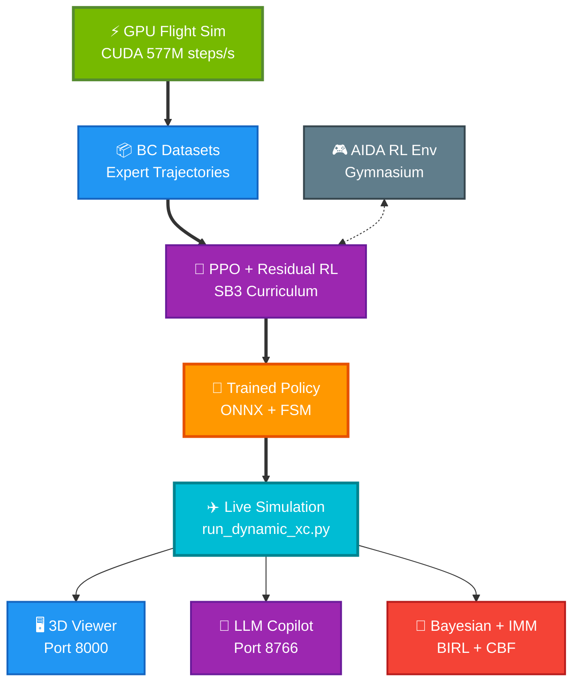

# AIDA Project Structure

Updated: February 1, 2026

## Directory Organization

```
/home/AIDA/
├── aida_sim/                        # Core simulation package
│   ├── __init__.py
│   ├── control/                     # Classical control
│   │   ├── autopilot.py             #   Multi-axis autopilot (heading, altitude, speed)
│   │   └── pid.py                   #   PID controller implementation
│   ├── dynamics/                    # Flight dynamics and physics
│   │   ├── forces.py                #   Aerodynamic/gravity/thrust force models
│   │   ├── integrator.py            #   RK4 numerical integrator
│   │   └── state.py                 #   12-state aircraft state representation
│   ├── env/                         # Gymnasium RL environments
│   │   ├── flight_env.py            #   Base flight environment
│   │   ├── flight_env_cessna172.py  #   Cessna 172 env with curriculum phases
│   │   ├── flight_env_rl.py         #   General RL flight environment
│   │   ├── teardrop_approach_env.py #   Teardrop approach pattern env
│   │   └── waypoint_env.py          #   Waypoint navigation env
│   ├── guidance/                    # Guidance algorithms
│   │   ├── commands.py              #   Flight command structures
│   │   ├── pure_pursuit.py          #   Pure pursuit lateral guidance
│   │   └── vector_field.py          #   Vector-field path following
│   ├── io/                          # Telemetry and I/O
│   │   └── telemetry.py             #   WebSocket telemetry server (port 8765)
│   ├── models/                      # Neural network architectures
│   │   └── unified_transformer.py   #   Transformer-based flight policy
│   ├── planning/                    # Mission planning
│   │   └── mission_planner.py       #   Route and waypoint planning
│   ├── platform/                    # World and airport infrastructure
│   │   ├── airports.py              #   Airport database (SN65, KHUT, KAAO, ...)
│   │   ├── assets.py                #   3D model asset management
│   │   ├── ground.py                #   Ground/terrain model
│   │   └── world.py                 #   World coordinate system
│   ├── safety/                      # Safety guards
│   │   └── guards.py                #   Envelope protection limits
│   ├── scenarios/                   # Pre-built flight scenarios
│   │   └── scenarios.py             #   Traffic pattern, XC, approach scenarios
│   ├── systems/                     # Aircraft subsystems
│   │   └── battery.py               #   Battery/power model
│   └── trajectory/                  # Trajectory generation
│       ├── dubins.py                #   Dubins path curves
│       ├── planner.py               #   Trajectory planner
│       ├── route_graph.py           #   Route graph for waypoint sequencing
│       └── trajectory.py            #   Trajectory data structures
│
├── llm/                             # LLM Flight Copilot + Bayesian stack
│   ├── llm_command_server.py        #   LLM inference server (port 8766)
│   │                                #     - Llama 3.1 8B xLAM function-calling
│   │                                #     - Command parsing, validation, execution
│   │                                #     - Direct override push to sim (port 8765)
│   ├── flight_intent.py             #   Intent classification & FlightCommand schema
│   ├── intent_validator.py          #   Rule-based command validation
│   ├── intent_schema.json           #   JSON schema for intent structure
│   ├── bayesian_intent.py           #   Bayesian intent inference engine
│   │                                #     - Von Mises heading posterior
│   │                                #     - Gaussian altitude/speed posteriors
│   │                                #     - Phase-aware prior modulation
│   │                                #     - Advisory hold for low confidence
│   ├── intent_bridge.py             #   Bridge between LLM and Bayesian layers
│   ├── intent_learning.py           #   IntentObservation collection & storage
│   ├── intent_training_pipeline.py  #   Iterative prior learning from sim data
│   ├── imm_estimator.py             #   Interacting Multiple Model estimator
│   │                                #     - 3 modes: tracking / maneuvering / anomalous
│   │                                #     - 16 phase-specific configurations
│   │                                #     - Markov transition probability matrix
│   ├── birl_inference.py            #   Bayesian Inverse RL (MCMC Policy Walk)
│   │                                #     - 4 features: tracking, safety, comfort, effort
│   │                                #     - Metropolis-Hastings on simplex
│   │                                #     - Posterior entropy for CBF modulation
│   ├── cbf_safety.py                #   Entropy-modulated Control Barrier Functions
│   │                                #     - 6 barrier functions (altitude, speed, attitude)
│   │                                #     - QP solver (SLSQP) for safe control
│   │                                #     - Entropy-adaptive safe set contraction
│   ├── test_intent_system.py        #   Intent system unit tests
│   └── models/                      # Local LLM model files
│       └── Llama-xLAM-2-8B-fc-r-Q4_K_M.gguf  # 4-bit quantized (CUDA offload)
│
├── scripts/                         # Flight scripts and training
│   ├── run_dynamic_xc.py            #   *** Primary flight loop ***
│   │                                #     - 6-DOF dynamics + NN policy + controller
│   │                                #     - IMM estimator integration
│   │                                #     - BIRL + CBF safety layer
│   │                                #     - WebSocket telemetry + LLM server launch
│   ├── generalized_xc_controller.py #   17-phase FSM cross-country controller
│   │                                #     - Phases: GROUND_ROLL → ... → LANDED
│   │                                #     - Heading/altitude/speed overrides
│   │                                #     - Route recalculation on diversion
│   │                                #     - Advisory hold integration
│   ├── earth_model.py               #   WGS-84 earth model for lat/lon conversion
│   ├── run_xc_sn65_khut.py          #   XC flight: SN65 → KHUT
│   ├── run_xc_khut_kaao.py          #   XC flight: KHUT → KAAO
│   ├── run_traffic_pattern*.py      #   Traffic pattern flights
│   ├── train_cessna172_curriculum.py #   Curriculum learning (5 phases)
│   ├── train_ppo*.py                #   PPO training variants
│   ├── train_residual_ppo*.py       #   Residual RL fine-tuning
│   ├── train_bc_*.py                #   Behavior cloning training
│   ├── train_waypoint_*.py          #   Waypoint navigation training
│   ├── train_route_generation.py    #   Route generation model training
│   ├── train_unified_model.py       #   Unified transformer training
│   ├── residual_env*.py             #   Residual RL environments
│   ├── gpu_to_aida_adapter.py       #   GPU sim ↔ AIDA env adapter
│   ├── generate_*.py                #   Demo/dataset generation scripts
│   ├── test_*.py                    #   Evaluation and test scripts
│   ├── stability_analysis.py        #   Open-loop stability analysis
│   └── utils/                       #   Shell utility scripts
│
├── viewer/                          # 3D Flight Visualization
│   ├── public/
│   │   ├── index.html               #   Three.js 3D viewer + HUD + telemetry
│   │   │                            #     - Real-time aircraft rendering
│   │   │                            #     - Agent mode / sim speed display
│   │   │                            #     - Attitude, velocity, position HUD
│   │   ├── chatbot.js               #   LLM chatbot interface (port 8766)
│   │   │                            #     - Natural language flight commands
│   │   │                            #     - Override forwarding to sim
│   │   ├── chatbot.css              #   Chatbot styling
│   │   ├── engine_sound.js          #   Procedural engine audio
│   │   ├── fetchRunwayConfig.js     #   Runway config loader
│   │   └── runway_config.json       #   Runway geometry config
│   └── README.md
│
├── gpu-flight-dynamics/             # GPU-accelerated CUDA flight simulator
│   ├── python/
│   │   ├── cuda_flight_sim.py       #   CUDA parallel flight sim (577M steps/s)
│   │   ├── flight_dynamics.py       #   CPU reference dynamics
│   │   ├── aircraft_database.py     #   Aircraft parameter database
│   │   ├── demo_f16.py              #   F-16 demo flight
│   │   ├── demo_udaan.py            #   Udaan demo flight
│   │   ├── visualize_flight.py      #   Flight visualization utilities
│   │   └── setup.py                 #   Package setup
│   ├── docker/
│   │   └── docker-compose.yml       #   Docker GPU environment
│   ├── README.md
│   ├── QUICKSTART_RTX4060.md
│   └── HANDOFF_REPORT.md
│
├── assets/                          # Project assets
│   ├── aircraft/                    #   3D models (Cessna 172, Udaan GLTF)
│   └── papers/                      #   Research papers and references
│
├── bc_data/                         # Behavior cloning datasets (NPZ)
│   ├── rotation_demos_*.npz         #   Ground roll / rotation demos
│   ├── initial_climb_demos_*.npz    #   Initial climb demos
│   ├── full_climb_demos_*.npz       #   Full climb demos
│   ├── cruise_demos_*.npz           #   Cruise flight demos
│   ├── waypoint_demos_*.npz         #   Waypoint navigation demos
│   └── triangle_approach_demos_*.npz#   Approach pattern demos
│
├── checkpoints/                     # Trained model checkpoints
│   ├── cessna172_curriculum/        #   Curriculum learning phases 1-5
│   ├── residual_ppo/                #   Residual RL fine-tuned policy
│   ├── route_gen/                   #   Route generation model
│   ├── route_gen_ppo/               #   Route generation PPO
│   ├── bc_dataset_*.npz             #   Behavior cloning datasets
│   └── stability_*.csv              #   Stability analysis results
│
├── config/                          # Configuration files
│   └── runway_config.json           #   Runway parameters (heading, elevation, length)
│
├── data/                            # Training data and observations
│   ├── expert_demos/                #   Expert demonstration trajectories
│   ├── scenario_demos/              #   Traffic pattern / XC scenario demos
│   ├── xc_demos/                    #   Cross-country flight recordings (40+)
│   └── intent_observations/         #   Bayesian intent training data
│       ├── learned_priors.json      #     186K+ observations, iterative priors
│       └── checkpoints/             #     Training round checkpoints
│
├── docs/                            # Documentation
│   ├── CROSS_COUNTRY_FLIGHT.md      #   XC flight architecture
│   ├── CONTROLLERS_OVERVIEW.md      #   Controller documentation
│   ├── LITERATURE_ASSESSMENT_UPDATED.md  # Literature review
│   ├── RESIDUAL_RL_FINDINGS.md      #   Residual RL experiment results
│   ├── HOW_PPO_LEARNS_GOOD_FLIGHT.md#   PPO training explanation
│   ├── CURRICULUM_LEARNING_IMPLEMENTATION.md
│   ├── CESSNA172_AUTONOMOUS_FLIGHT.md
│   ├── guidance_algorithms.md       #   Pure pursuit + vector field docs
│   ├── dev/                         #   Development notes
│   ├── img/                         #   Documentation images
│   ├── reference/                   #   Reference data (CSV, PDFs)
│   └── session_summaries/           #   Historical session summaries
│
├── models/                          # Shared model directory
│
├── scripts_archive/                 # Archived/deprecated scripts
│
├── test_scripts/                    # Development test scripts
│   ├── test_elevator_control.py
│   ├── test_takeoff_corrected.py
│   └── verify_elevator_sign.py
│
├── .venv-linux/                     # Python virtual environment (Python 3.10)
├── .git/                            # Git repository
├── .gitignore
├── README.md                        # Main project README
├── DISCUSSION.md                    # Research discussion notes
├── PROJECT_STRUCTURE.md             # This file
└── requirements.txt                 # Python dependencies
```

## Key Modules

### LLM + Bayesian Intelligence Stack (`llm/`)

| File | Purpose |
|------|---------|
| `llm_command_server.py` | LLM inference (Llama 3.1 8B xLAM), command parsing, override pipeline |
| `bayesian_intent.py` | Von Mises / Gaussian posteriors, phase-aware priors, advisory hold |
| `imm_estimator.py` | 3-mode IMM estimator with 16 phase configs, Markov TPM |
| `birl_inference.py` | MCMC reward inference (4 features), posterior entropy |
| `cbf_safety.py` | 6 entropy-modulated barrier functions, SLSQP QP solver |
| `intent_learning.py` | IntentObservation collection, feature extraction |
| `intent_training_pipeline.py` | Iterative prior learning from batch simulation |
| `flight_intent.py` | FlightCommand schema, intent classification |
| `intent_validator.py` | Rule-based envelope validation |
| `intent_bridge.py` | LLM ↔ Bayesian layer bridge |

### Flight Controller (`scripts/generalized_xc_controller.py`)

17-phase finite state machine:
```
GROUND_ROLL → ROTATION → INITIAL_CLIMB → CROSSWIND_TURN →
CROSSWIND → DOWNWIND_TURN → DEPARTURE → EN_ROUTE →
ARRIVAL → PATTERN_ENTRY → DOWNWIND → BASE_TURN →
BASE → FINAL_TURN → FINAL_APPROACH → LANDING → LANDED
```

Features: heading/altitude/speed overrides, route recalculation on diversion, advisory hold integration, terminal phase guard.

### Primary Simulation Loop (`scripts/run_dynamic_xc.py`)

Orchestrates the complete flight pipeline:
1. 6-DOF dynamics (RK4 integration at 50 Hz)
2. Neural network policy inference (ONNX)
3. Generalized XC controller (17-phase FSM)
4. IMM estimator (3-mode state estimation)
5. BIRL feature extraction + MCMC update (1 Hz)
6. CBF safety filter (QP-based)
7. WebSocket telemetry broadcast
8. LLM command server (async, port 8766)

### 6-DOF Flight Dynamics (`aida_sim/dynamics/`)

- **State**: 12-dimensional [x, y, z, phi, theta, psi, u, v, w, p, q, r]
- **Control**: 7-dimensional [aileron, elevator, rudder, throttle, flaps, mixture, brakes]
- **Integration**: 4th-order Runge-Kutta (RK4)
- **Forces**: Aerodynamic (Cessna 172 coefficients), gravity, thrust, ground reaction

### GPU Simulator (`gpu-flight-dynamics/`)

CUDA-accelerated parallel flight simulation:
- 577 million steps/second on RTX 4060
- 128 parallel environments
- Used for batch demo generation and training data

### 3D Viewer (`viewer/`)

Browser-based Three.js visualization:
- Real-time aircraft rendering with terrain
- Flight HUD (attitude, altitude, speed, heading)
- Agent mode and sim speed display
- LLM chatbot sidebar for natural language commands
- WebSocket telemetry on port 8765

## Data Pipeline



## Telemetry Protocol

All components communicate via WebSocket:

| Port | Service | Direction |
|------|---------|-----------|
| 8765 | Telemetry server | Sim → Viewer (state broadcast), Viewer/LLM → Sim (overrides) |
| 8766 | LLM command server | Chatbot → LLM (NL commands), LLM → Chatbot (responses) |
| 8000 | HTTP file server | Serves viewer/public/ static files |

## Training Checkpoints

| Model | Path | Method |
|-------|------|--------|
| Phase 1: Ground Roll | `checkpoints/cessna172_curriculum/phase1_ground_roll/` | Curriculum PPO |
| Phase 2: Rotation | `checkpoints/cessna172_curriculum/phase2_rotation/` | Curriculum PPO |
| Phase 3: Initial Climb | `checkpoints/cessna172_curriculum/phase3_initial_climb/` | Curriculum PPO |
| Phase 4: Full Climb | `checkpoints/cessna172_curriculum/phase4_full_climb/` | Curriculum PPO |
| Phase 5: Cruise | `checkpoints/cessna172_curriculum/phase5_cruise/` | Curriculum PPO |
| Residual RL | `checkpoints/residual_ppo/` | Residual PPO fine-tuning |
| Route Generation | `checkpoints/route_gen/` | Supervised + PPO |

## Bayesian Intent Data

| File | Contents |
|------|----------|
| `data/intent_observations/learned_priors.json` | 186K+ observations, iterative Bayesian priors |
| `data/intent_observations/checkpoints/` | 5 training rounds with metrics |
| `data/xc_demos/` | 40+ cross-country flight recordings |

## Supported Airports

| ICAO | Name | Elevation | Runway |
|------|------|-----------|--------|
| SN65 | Sunflower Aerodrome | 1423 ft | 17/35 |
| KHUT | Hutchinson Municipal | 1524 ft | 13/31 |
| KAAO | Wichita Colonel James Jabara | 1421 ft | 18/36 |

## Development Workflow

1. **Environment**: Python 3.10 venv in `.venv-linux/` on WSL2 (Ubuntu 22.04)
2. **GPU**: NVIDIA RTX 4060 — CUDA for flight sim, PyTorch training, and LLM inference
3. **Training**: Curriculum learning → Residual RL → Batch validation
4. **Live flight**: `python scripts/run_dynamic_xc.py` (launches sim + telemetry + LLM)
5. **Viewer**: Open `http://localhost:8000` in browser
6. **Monitoring**: TensorBoard on port 6006, intent logs in `data/intent_observations/`

## Important Notes

- All scripts should be run from `/home/AIDA/` root directory
- LLM model requires CUDA GPU offload (33 layers on RTX 4060, ~4.4 GB VRAM)
- Sim runs at 50 Hz internal, viewer at ~30 fps, IMM at 50 Hz, BIRL MCMC at 1 Hz
- Body-frame velocity [u, v, w] is used for telemetry; NED velocity sent separately
