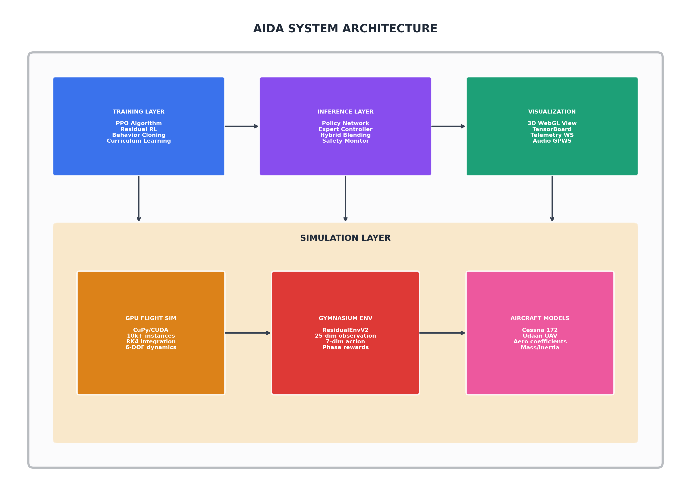
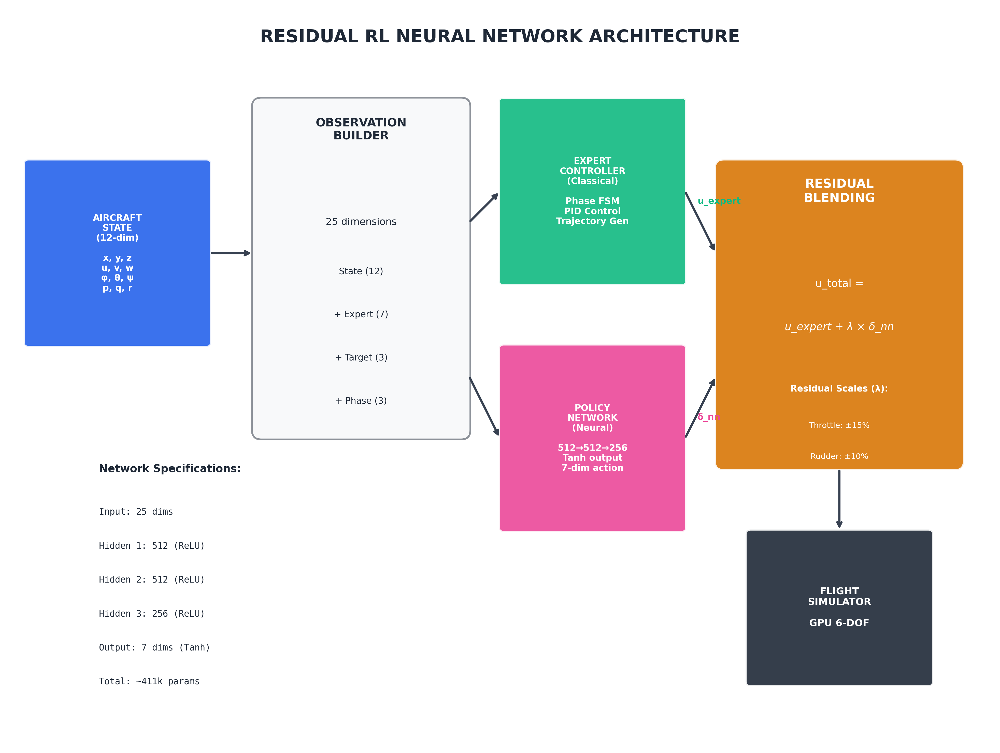
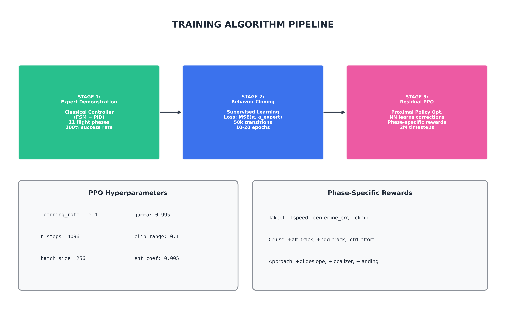
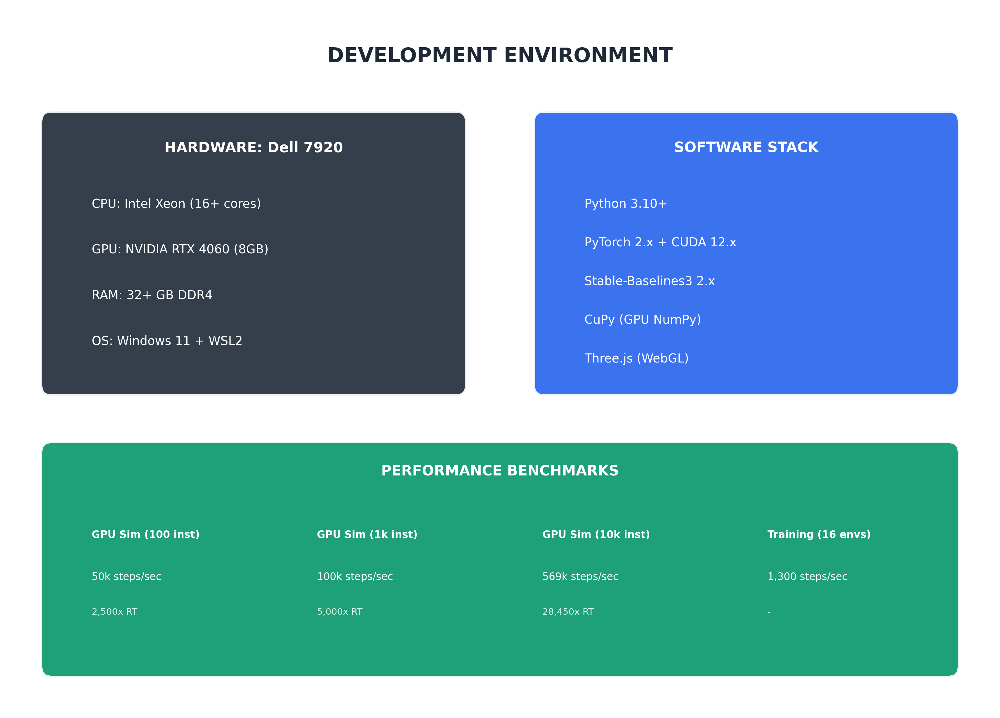
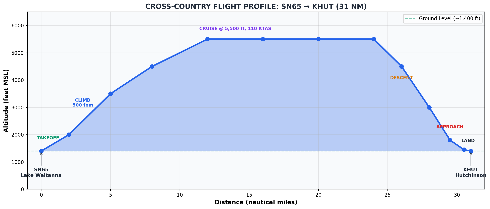
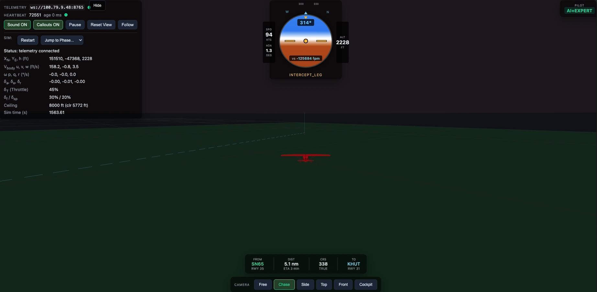
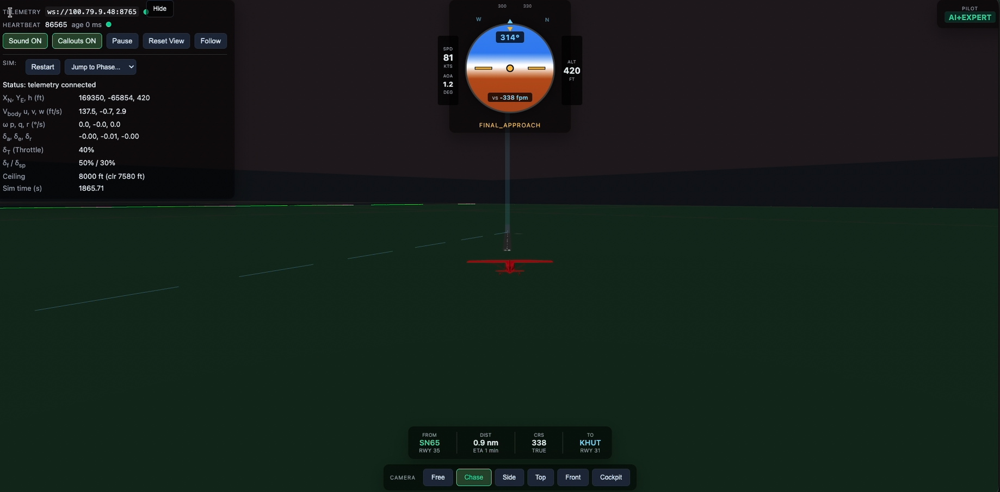

# AIDA - Autonomous Intelligent Decision Architecture

**Advanced Reinforcement Learning Framework for Autonomous Fixed-Wing Aircraft Control**

[](#)
[](https://www.python.org/downloads/)
[](https://developer.nvidia.com/cuda-toolkit)
[](https://stable-baselines3.readthedocs.io/)
[](https://huggingface.co/microsoft/Phi-3-mini-4k-instruct)

---

## Executive Summary

AIDA is a research framework that combines classical control theory with modern deep reinforcement learning to achieve fully autonomous fixed-wing aircraft flight. The system has demonstrated **complete autonomous cross-country flights** from takeoff to landing, covering 31 nautical miles with precision runway alignment.

### Key Achievements

| Milestone | Description | Date |
|-----------|-------------|------|
| **LLM Flight Commands** | Natural language control via Phi-3 ("climb to 7000", "heading 270") | Jan 2026 |
| **Cross-Country Flight** | 31 NM autonomous flight SN65 → KHUT with precision landing | Jan 2026 |
| **Residual RL V2** | 7-control neural network learns corrections to expert | Jan 2026 |
| **GPU-Accelerated Simulation** | 569,000 steps/sec with 10,000 parallel instances | Dec 2025 |
| **Real-Time 3D Visualization** | WebSocket telemetry with audio synthesis | Dec 2025 |

---

## Table of Contents

1. [System Architecture](#system-architecture)
2. [LLM Flight Commands](#llm-flight-commands)
3. [Neural Network Architecture](#neural-network-architecture)
4. [Algorithms & Training Methods](#algorithms--training-methods)
5. [Development Environment](#development-environment)
6. [Flight Demonstrations](#flight-demonstrations)
7. [Quick Start](#quick-start)
8. [Project Structure](#project-structure)

---

## System Architecture

The AIDA system is organized into four main layers: Training, Inference, Visualization, and Simulation.



### Component Overview

| Layer | Components | Purpose |
|-------|------------|---------|
| **Training** | PPO, Residual RL, Behavior Cloning | Learn optimal control policies |
| **Inference** | Policy Network, Expert Controller | Real-time flight control |
| **Visualization** | 3D WebGL, TensorBoard, Telemetry | Monitoring and debugging |
| **Simulation** | GPU Flight Dynamics, Gymnasium Env | High-fidelity physics |

---

## LLM Flight Commands

AIDA V1 introduces **natural language flight control** via an integrated chatbot interface. Pilots can issue commands in plain English, which are parsed by the Phi-3 Mini LLM and executed by the autopilot.

### Supported Commands

| Command Type | Examples | Flight Phase |
|--------------|----------|--------------|
| **Heading** | "turn to heading 270", "fly heading 090" | CLIMB, CRUISE |
| **Altitude** | "climb to 7000", "descend to 4000 feet" | CRUISE |
| **Landing** | "land at KHUT", "resume landing" | CRUISE |
| **Status** | "status", "where am I" | Any |

### Architecture

```
┌─────────────┐     ┌─────────────┐     ┌─────────────┐     ┌─────────────┐
│   Chatbot   │────▶│  LLM Server │────▶│  Telemetry  │────▶│  Controller │
│   (UI)      │     │  (Phi-3)    │     │  WebSocket  │     │  (Expert)   │
│  Port 8000  │     │  Port 8766  │     │  Port 8765  │     │             │
└─────────────┘     └─────────────┘     └─────────────┘     └─────────────┘
     │                    │                    │                    │
     │    "climb 7000"    │                    │                    │
     │───────────────────▶│                    │                    │
     │                    │  {action: "set_altitude", value: 7000}  │
     │                    │───────────────────▶│───────────────────▶│
     │    "Roger, climbing to 7,000 feet"      │                    │
     │◀───────────────────│                    │     Aircraft       │
     │                    │                    │     Responds       │
```

### Safety Features

- **Altitude Limits**: Min 1,500 ft AGL, Max 12,000 ft (service ceiling)
- **Phase Restrictions**: Overrides disabled during approach/landing for safety
- **Validation**: All commands validated before execution
- **Pilot Acknowledgements**: Realistic pilot-style responses ("Roger, turning left to heading 270")

### Running LLM Commands

```bash
# Terminal 1: HTTP server for viewer
cd /home/AIDA/viewer/public && python3 -m http.server 8000

# Terminal 2: LLM command server
source .venv-linux/bin/activate
python3 llm/llm_command_server.py --host 0.0.0.0 --port 8766

# Terminal 3: Flight simulation
python3 scripts/run_xc_sn65_khut.py

# Open browser: http://localhost:8000
# Use chatbot in bottom-right corner
```

---

## Software Architecture

The codebase is organized into modular packages for simulation, training, visualization, and GPU acceleration.


### Package Structure

```
AIDA/
├── aida_sim/           # Core simulation (envs, dynamics, systems)
├── scripts/            # Training and inference scripts
├── viewer/             # 3D WebGL visualization
├── gpu-flight-dynamics/# CUDA-accelerated physics
├── models/             # Trained model weights (git tracked)
├── checkpoints/        # Training checkpoints (not in git)
└── docs/               # Documentation and diagrams
```

---

## Neural Network Architecture

### Residual RL Architecture (V2)

The Residual RL approach learns **corrections** to an expert controller rather than learning from scratch. This provides stability guarantees while allowing the neural network to improve performance.



### Key Design Principles

1. **Expert Baseline**: Classical FSM + PID controller handles all 11 flight phases
2. **Neural Corrections**: NN outputs small adjustments (δ) scaled by per-control factors
3. **Safe Blending**: `u_total = u_expert + λ × δ_nn` ensures bounded corrections

### Network Specifications

| Component | Specification |
|-----------|---------------|
| **Input** | 25 dimensions (state + expert + target + phase) |
| **Hidden Layers** | 512 → 512 → 256 (ReLU activation) |
| **Output** | 7 dimensions (Tanh → scaled residuals) |
| **Parameters** | ~411,000 trainable weights |

### Observation Space (25 dimensions)

```python
observation = [
    # Aircraft State (12 dims)
    x, y, z,           # Position (m)
    u, v, w,           # Body velocities (m/s)
    phi, theta, psi,   # Euler angles (rad)
    p, q, r,           # Angular rates (rad/s)

    # Expert Action (7 dims)
    throttle, aileron, elevator, rudder, flaps, spoilers, brakes

    # Navigation Target (3 dims)
    heading_error, distance, altitude_error

    # Flight Phase One-Hot (3 dims)
    is_takeoff, is_cruise, is_approach
]
```

### Action Space (7 dimensions)

| Control | Residual Scale | Range |
|---------|----------------|-------|
| Throttle | ±15% | [0, 1] |
| Aileron | ±10% | [-1, 1] |
| Elevator | ±15% | [-1, 1] |
| Rudder | ±10% | [-1, 1] |
| Flaps | ±10% | [0, 1] |
| Spoilers | ±15% | [0, 1] |
| Brakes | ±10% | [0, 1] |

---

## Algorithms & Training Methods

The training pipeline consists of three stages: expert demonstration, optional behavior cloning, and residual PPO fine-tuning.



### PPO Hyperparameters

| Parameter | Value | Rationale |
|-----------|-------|-----------|
| `learning_rate` | 1e-4 | Conservative for stability |
| `n_steps` | 4096 | Long rollouts for 15-min episodes |
| `batch_size` | 256 | Large batch for variance reduction |
| `n_epochs` | 10 | Multiple passes per rollout |
| `gamma` | 0.995 | High discount for long episodes |
| `clip_range` | 0.1 | Small clip for stable updates |

### Phase-Specific Reward Shaping

**Takeoff (Ground Roll → Initial Climb)**
- Centerline tracking: +5.0 for Y < 0.3m, else -Y² penalty
- Heading alignment: -heading² × 5.0
- Wings level: -|roll| × 10.0

**Cruise**
- Altitude tracking: reward for maintaining 5,500 ft
- Heading tracking: reward for waypoint alignment
- Control smoothness: penalize excessive inputs

**Approach & Landing**
- Glideslope tracking: 3° descent path
- Localizer tracking: runway centerline
- Airspeed control: 65 KTAS approach, 50 KTAS touchdown

---

## Development Environment



### Hardware Requirements

| Component | Specification |
|-----------|---------------|
| **CPU** | Intel Xeon / AMD (16+ cores recommended) |
| **GPU** | NVIDIA RTX 4060+ (8GB VRAM) |
| **RAM** | 32+ GB DDR4 |
| **OS** | Windows 11 + WSL2 or native Linux |

### Software Stack

| Package | Version | Purpose |
|---------|---------|---------|
| Python | 3.10+ | Runtime |
| PyTorch | 2.x | Neural networks |
| Stable-Baselines3 | 2.x | PPO implementation |
| CuPy | 12.x | GPU-accelerated NumPy |
| Gymnasium | 0.29+ | RL environment API |
| Three.js | r150+ | 3D web rendering |

### Performance Benchmarks

| Configuration | Throughput | Real-Time Factor |
|---------------|------------|------------------|
| GPU Sim (100 instances) | 50,000 steps/sec | 2,500x |
| GPU Sim (1,000 instances) | 100,000 steps/sec | 5,000x |
| GPU Sim (10,000 instances) | 569,000 steps/sec | 28,450x |
| Training (16 parallel envs) | 1,300 steps/sec | - |

---

## Flight Demonstrations

### Cross-Country Flight: SN65 → KHUT

**Route:** Lake Waltanna (SN65) to Hutchinson Regional Airport (KHUT)
**Distance:** 31 nautical miles
**Duration:** ~18 minutes (simulated)



### 11 Autonomous Flight Phases

| Phase | Description | Key Parameters |
|-------|-------------|----------------|
| GROUND_ROLL | Accelerate on runway | Full throttle, V_rotate = 54 KTAS |
| ROTATION | Pitch up for liftoff | 10° pitch target |
| INITIAL_CLIMB | Clear obstacles | V_climb = 74 KTAS |
| CLIMB | Climb to cruise | 500 fpm, heading to TP |
| CRUISE_TO_TP | Level cruise | 5,500 ft, 110 KTAS |
| TURN_TO_INTERCEPT | Procedure turn | Roll to runway heading |
| INTERCEPT_LEG | Intercept final | Glideslope capture |
| FINAL_APPROACH | Stabilized approach | 3° glideslope, 65 KTAS |
| SHORT_FINAL | Pre-landing | Flaps full, 60 KTAS |
| LANDING | Flare and touchdown | Idle thrust, 50 KTAS |
| LANDED | Mission complete | Brakes applied |

### Flight Screenshots

**Intercept Leg - Approaching KHUT**



**Final Approach - Runway in Sight**



---

## Quick Start

### Prerequisites

```bash
# System requirements
- Python 3.10+
- NVIDIA GPU with CUDA 12.x (recommended)
- WSL2 (Windows) or native Linux
- 8+ GB RAM
```

### Installation

```bash
# Clone and setup
cd /home/AIDA
python3 -m venv .venv-linux
source .venv-linux/bin/activate

# Install dependencies
pip install -r requirements.txt
```

### Run Expert Flight Demo

```bash
# Terminal 1: Start viewer server
cd /home/AIDA/viewer/public && python -m http.server 8000

# Terminal 2: Run cross-country flight
source .venv-linux/bin/activate
python scripts/run_residual_telemetry_v2.py --pure-expert

# Open browser: http://localhost:8000
```

### Train Residual RL Policy

```bash
# Train with 8 parallel environments
python scripts/train_residual_ppo_v2.py \
    --timesteps 2000000 \
    --n-envs 8

# Monitor training
tensorboard --logdir checkpoints/residual_ppo_v2/logs --port 6006
```

### Run Trained Policy

```bash
# Run with trained model
python scripts/run_residual_telemetry_v2.py \
    --model models/residual_ppo_v2_7ctrl.zip
```

---

## Project Structure

```
AIDA/
├── aida_sim/                    # Core simulation package
│   ├── env/                     # RL environments
│   │   └── residual_env_v2.py   # 7-control residual environment
│   ├── dynamics/                # Flight physics
│   └── systems/                 # Aircraft subsystems
│
├── gpu-flight-dynamics/         # CUDA parallel simulator
│   └── python/
│       ├── flight_dynamics.py   # GPU-accelerated 6-DOF
│       └── aircraft_database.py # Aircraft configurations
│
├── scripts/                     # Training and utility scripts
│   ├── train_residual_ppo_v2.py # Main training script
│   ├── run_residual_telemetry_v2.py
│   └── triangle_controller.py   # Expert FSM controller
│
├── viewer/                      # 3D visualization
│   └── public/
│       ├── index.html           # WebGL viewer + telemetry
│       ├── chatbot.js           # LLM command chatbot UI
│       └── chatbot.css          # Chatbot styling
│
├── models/                      # Trained models (git tracked)
│   └── residual_ppo_v2_7ctrl.zip
│
├── checkpoints/                 # Training checkpoints (not in git)
│
├── llm/                         # LLM integration (Phi-3)
│   ├── llm_command_server.py    # WebSocket server for natural language commands
│   └── models/                  # Phi-3 GGUF model files
│
└── docs/                        # Documentation
    ├── img/                     # Architecture diagrams
    └── RESIDUAL_RL_FINDINGS.md  # Training findings
```

---

## References

1. **Stable-Baselines3**: [https://stable-baselines3.readthedocs.io/](https://stable-baselines3.readthedocs.io/)
2. **PPO Algorithm**: Schulman et al., "Proximal Policy Optimization Algorithms" (2017)
3. **Residual RL**: Silver et al., "Residual Policy Learning" (2018)
4. **Flight Dynamics**: Stevens & Lewis, "Aircraft Control and Simulation" (3rd ed.)

---

## License

Internal research project - Kushal Koirala

---

## Version History

| Version | Date | Highlights |
|---------|------|------------|
| **V1.0** | Jan 11, 2026 | LLM flight commands, cross-country demo, residual RL V2 |

---

**Last Updated**: January 11, 2026
