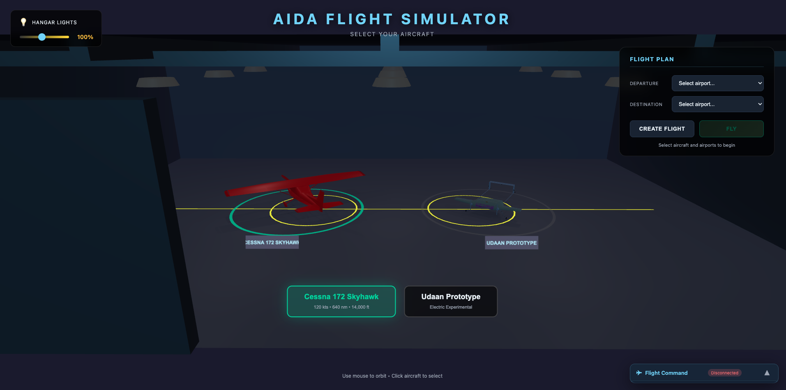

# AIDA - Autonomous Intelligent Decision Architecture

**Advanced Reinforcement Learning Framework for Autonomous Fixed-Wing Aircraft Control**

[](#)
[](https://www.python.org/downloads/)
[](https://huggingface.co/Salesforce/xLAM-2-8b-fc-r)
[](https://docs.microsoft.com/en-us/windows/wsl/)

---

## Quick Start Guide

This section provides step-by-step instructions to download, install, and run the AIDA Flight Simulator.

### Prerequisites

- **Operating System**: Windows 11 with WSL2 (Ubuntu 22.04) or native Linux
- **Python**: 3.10 or higher
- **RAM**: 8+ GB (16+ GB recommended for LLM)
- **GPU**: Optional but recommended for LLM inference
- **Disk Space**: ~6 GB (including LLM model)

### Step 1: Clone the Repository

```bash
# In WSL2 Ubuntu terminal
cd /home
git clone https://github.com/YOUR_USERNAME/AIDA.git
cd AIDA
```

### Step 2: Create Python Virtual Environment

```bash
python3 -m venv .venv-linux
source .venv-linux/bin/activate
```

### Step 3: Install Dependencies

```bash
pip install --upgrade pip
pip install -r requirements.txt

# Install LLM support (llama-cpp-python)
pip install llama-cpp-python
```

### Step 4: Download the LLM Model

The AIDA flight assistant uses **xLAM-2-8B**, a function-calling optimized LLM.

```bash
# Create models directory
mkdir -p llm/models
cd llm/models

# Download from Hugging Face (4.6 GB)
wget https://huggingface.co/bartowski/Llama-xLAM-2-8B-fc-r-GGUF/resolve/main/Llama-xLAM-2-8B-fc-r-Q4_K_M.gguf

# Return to project root
cd ../..
```

**Alternative**: Download manually from [Hugging Face](https://huggingface.co/bartowski/Llama-xLAM-2-8B-fc-r-GGUF) and place in `llm/models/`.

### Step 5: Start the Simulator

**Option A: All-in-One Script (Recommended)**

```bash
./start_aida.sh
```

This starts all three servers:
- HTTP Viewer Server (port 8000)
- Flight Dynamics Server (port 8765)
- LLM Command Server (port 8766)

**Option B: Manual Start (Three Terminals)**

```bash
# Terminal 1: HTTP Viewer Server
cd /home/AIDA/viewer/public
python3 -m http.server 8000

# Terminal 2: Flight Dynamics Server
cd /home/AIDA
source .venv-linux/bin/activate
python scripts/run_dynamic_xc.py --speed 2

# Terminal 3: LLM Command Server
cd /home/AIDA
source .venv-linux/bin/activate
python llm/llm_command_server.py
```

### Step 6: Open the Viewer

Open your browser and navigate to:

```
http://localhost:8000
```

You will see:
1. **3D Hangar** - Click an aircraft to select it
2. **Flight Planning** - Choose origin/destination airports
3. **Click "Start Flight"** - The autonomous flight begins

### Step 7: Use Voice Commands (Optional)

The chatbot panel in the bottom-right corner accepts natural language commands:

| Command | Example |
|---------|---------|
| Change heading | "turn to heading 270" |
| Change altitude | "climb to 7000 feet" |
| Land at airport | "land at KHUT" |
| Get status | "sitrep" or "status" |
| Nearest airport | "nearest airport" |
| Time to destination | "ETA" or "how long" |
| Top of descent | "when should I descend" |

### Stopping the Simulator

```bash
./stop_aida.sh
# Or manually: pkill -f "python.*run_dynamic_xc"
```

---

## Executive Summary

AIDA is a research framework that combines classical control theory with modern deep reinforcement learning to achieve fully autonomous fixed-wing aircraft flight. The system has demonstrated **complete autonomous cross-country flights** from takeoff to landing, covering 31 nautical miles with precision runway alignment.

### Key Achievements (Version A)

| Milestone | Description | Date |
|-----------|-------------|------|
| **LLM Flight Assistant** | xLAM-2-8B with function calling for natural language control | Jan 2026 |
| **Cross-Country Flight** | 31 NM autonomous flight SN65 to KHUT with precision landing | Jan 2026 |
| **3D Hangar Mode** | Interactive aircraft selection in immersive hangar environment | Jan 2026 |
| **Flight Path Planner** | Automatic waypoint generation with procedure turns | Jan 2026 |
| **Real-Time 3D Viewer** | WebGL visualization with WebSocket telemetry | Jan 2026 |

---

## What's New in Version A (January 2026)

### 🛫 3D Hangar Mode

The viewer now features an immersive **3D hangar environment** for aircraft selection before flight. Users can orbit around life-sized aircraft models and click to select their aircraft.



**Features:**
- Interactive aircraft selection with visual highlighting
- Adjustable hangar lighting with ambient control slider
- Realistic aircraft scaling (Cessna 172 and Udaan prototype)
- Smooth camera transitions between hangar and flight modes

### ✈️ Multiple Kansas Airports

Added support for **multiple departure and destination airports** across Kansas:

| Airport | Name | Elevation |
|---------|------|-----------|
| KHUT | Hutchinson Regional | 1,524 ft |
| KICT | Wichita Dwight D. Eisenhower | 1,333 ft |
| KSLN | Salina Regional | 1,288 ft |
| KGBD | Great Bend Municipal | 1,887 ft |
| SN65 | Lake Waltanna (Private) | 1,532 ft |

### 📐 Flight Path Calculator

New **flight path planning system** that automatically calculates:
- Optimal cruise altitude based on distance
- Procedure turn geometry for runway alignment
- Waypoint generation with turn anticipation
- Glideslope intercept positioning

### 🤖 Transformer-Based Controllers

Introduced experimental **transformer neural network architectures** for flight control:
- Multi-head attention for temporal sequence modeling
- Position encoding for time-aware predictions
- Comparison studies with traditional MLP architectures

### 🎮 Controller Improvements

Enhanced the expert FSM controller with:
- Improved phase transition logic
- Better wind compensation during approach
- Smoother control surface actuation
- Refined landing flare maneuver

---

## Table of Contents

1. [System Architecture](#system-architecture)
2. [LLM Flight Commands](#llm-flight-commands)
3. [Neural Network Architecture](#neural-network-architecture)
4. [Algorithms & Training Methods](#algorithms--training-methods)
5. [Development Environment](#development-environment)
6. [Flight Demonstrations](#flight-demonstrations)
7. [Quick Start](#quick-start)
8. [Project Structure](#project-structure)

---

## System Architecture

The AIDA system is organized into four main layers: Training, Inference, Visualization, and Simulation.


### Component Overview

| Layer | Components | Purpose |
|-------|------------|---------|
| **Training** | PPO, Residual RL, Behavior Cloning | Learn optimal control policies |
| **Inference** | Policy Network, Expert Controller | Real-time flight control |
| **Visualization** | 3D WebGL, TensorBoard, Telemetry | Monitoring and debugging |
| **Simulation** | GPU Flight Dynamics, Gymnasium Env | High-fidelity physics |

---

## LLM Flight Assistant (AIDA)

AIDA includes an integrated **AI copilot** powered by xLAM-2-8B, a function-calling optimized LLM. The assistant understands natural language commands and provides intelligent flight assistance.

### Supported Commands

| Command Type | Examples | Description |
|--------------|----------|-------------|
| **Heading** | "turn to heading 270", "fly heading 090" | Change aircraft heading |
| **Altitude** | "climb to 7000", "descend to 4000 feet" | Change target altitude |
| **Landing** | "land at KHUT", "divert to KICT" | Initiate approach to airport |
| **Return to Cruise** | "return to cruise", "resume cruise altitude" | Return to planned cruise altitude |
| **Status** | "status", "sitrep", "brief me" | Get comprehensive situation report |
| **Nearest Airport** | "nearest airport", "where can I land" | Find closest airports for diversion |
| **ETA** | "ETA", "how long", "time to destination" | Calculate time to destination |
| **Top of Descent** | "when to descend", "TOD" | Calculate descent planning |
| **Aviation Questions** | "what's the stall speed", "spin recovery" | Answer aviation knowledge questions |

### LLM Capabilities

The AIDA flight assistant includes:

- **Cessna 172 Knowledge**: V-speeds, engine specs, fuel capacity, performance data
- **Emergency Procedures**: Engine failure, electrical fire, spin recovery (PARE)
- **Flight Planning**: ETA calculations, fuel estimates, descent planning
- **Situational Awareness**: Nearby airports, distance/bearing to airports
- **Professional Phraseology**: Speaks like an experienced pilot

### Architecture

```
┌─────────────┐     ┌─────────────┐     ┌─────────────┐     ┌─────────────┐
│   Chatbot   │────▶│  LLM Server │────▶│  Telemetry  │────▶│  Controller │
│   (UI)      │     │ (xLAM-2-8B) │     │  WebSocket  │     │  (Expert)   │
│  Port 8000  │     │  Port 8766  │     │  Port 8765  │     │             │
└─────────────┘     └─────────────┘     └─────────────┘     └─────────────┘
     │                    │                    │                    │
     │    "climb 7000"    │                    │                    │
     │───────────────────▶│                    │                    │
     │                    │  {action: "set_altitude", value: 7000}  │
     │                    │───────────────────▶│───────────────────▶│
     │    "Roger, climbing to 7,000 feet"      │                    │
     │◀───────────────────│                    │     Aircraft       │
     │                    │                    │     Responds       │
```

### Safety Features

- **Altitude Limits**: Min 1,500 ft AGL, Max 12,000 ft (service ceiling)
- **Phase Restrictions**: Overrides disabled during approach/landing for safety
- **Validation**: All commands validated before execution
- **Pilot Acknowledgements**: Realistic pilot-style responses

---

## Software Architecture

The codebase is organized into modular packages for simulation, training, visualization, and GPU acceleration.


### Package Structure

```
AIDA/
├── aida_sim/           # Core simulation (envs, dynamics, systems)
├── scripts/            # Training and inference scripts
├── viewer/             # 3D WebGL visualization
├── gpu-flight-dynamics/# CUDA-accelerated physics
├── models/             # Trained model weights (git tracked)
├── checkpoints/        # Training checkpoints (not in git)
└── docs/               # Documentation and diagrams
```

---

## Neural Network Architecture

### Residual RL Architecture (V2)

The Residual RL approach learns **corrections** to an expert controller rather than learning from scratch. This provides stability guarantees while allowing the neural network to improve performance.


### Key Design Principles

1. **Expert Baseline**: Classical FSM + PID controller handles all 11 flight phases
2. **Neural Corrections**: NN outputs small adjustments (δ) scaled by per-control factors
3. **Safe Blending**: `u_total = u_expert + λ × δ_nn` ensures bounded corrections

### Network Specifications

| Component | Specification |
|-----------|---------------|
| **Input** | 25 dimensions (state + expert + target + phase) |
| **Hidden Layers** | 512 → 512 → 256 (ReLU activation) |
| **Output** | 7 dimensions (Tanh → scaled residuals) |
| **Parameters** | ~411,000 trainable weights |

### Observation Space (25 dimensions)

```python
observation = [
    # Aircraft State (12 dims)
    x, y, z,           # Position (m)
    u, v, w,           # Body velocities (m/s)
    phi, theta, psi,   # Euler angles (rad)
    p, q, r,           # Angular rates (rad/s)

    # Expert Action (7 dims)
    throttle, aileron, elevator, rudder, flaps, spoilers, brakes

    # Navigation Target (3 dims)
    heading_error, distance, altitude_error

    # Flight Phase One-Hot (3 dims)
    is_takeoff, is_cruise, is_approach
]
```

### Action Space (7 dimensions)

| Control | Residual Scale | Range |
|---------|----------------|-------|
| Throttle | ±15% | [0, 1] |
| Aileron | ±10% | [-1, 1] |
| Elevator | ±15% | [-1, 1] |
| Rudder | ±10% | [-1, 1] |
| Flaps | ±10% | [0, 1] |
| Spoilers | ±15% | [0, 1] |
| Brakes | ±10% | [0, 1] |

---

## Algorithms & Training Methods

The training pipeline consists of three stages: expert demonstration, optional behavior cloning, and residual PPO fine-tuning.


### PPO Hyperparameters

| Parameter | Value | Rationale |
|-----------|-------|-----------|
| `learning_rate` | 1e-4 | Conservative for stability |
| `n_steps` | 4096 | Long rollouts for 15-min episodes |
| `batch_size` | 256 | Large batch for variance reduction |
| `n_epochs` | 10 | Multiple passes per rollout |
| `gamma` | 0.995 | High discount for long episodes |
| `clip_range` | 0.1 | Small clip for stable updates |

### Phase-Specific Reward Shaping

**Takeoff (Ground Roll → Initial Climb)**
- Centerline tracking: +5.0 for Y < 0.3m, else -Y² penalty
- Heading alignment: -heading² × 5.0
- Wings level: -|roll| × 10.0

**Cruise**
- Altitude tracking: reward for maintaining 5,500 ft
- Heading tracking: reward for waypoint alignment
- Control smoothness: penalize excessive inputs

**Approach & Landing**
- Glideslope tracking: 3° descent path
- Localizer tracking: runway centerline
- Airspeed control: 65 KTAS approach, 50 KTAS touchdown

---

## Development Environment


### Hardware Requirements

| Component | Specification |
|-----------|---------------|
| **CPU** | Intel Xeon / AMD (16+ cores recommended) |
| **GPU** | NVIDIA RTX 4060+ (8GB VRAM) |
| **RAM** | 32+ GB DDR4 |
| **OS** | Windows 11 + WSL2 or native Linux |

### Software Stack

| Package | Version | Purpose |
|---------|---------|---------|
| Python | 3.10+ | Runtime |
| PyTorch | 2.x | Neural networks |
| Stable-Baselines3 | 2.x | PPO implementation |
| CuPy | 12.x | GPU-accelerated NumPy |
| Gymnasium | 0.29+ | RL environment API |
| Three.js | r150+ | 3D web rendering |

### Performance Benchmarks

| Configuration | Throughput | Real-Time Factor |
|---------------|------------|------------------|
| GPU Sim (100 instances) | 50,000 steps/sec | 2,500x |
| GPU Sim (1,000 instances) | 100,000 steps/sec | 5,000x |
| GPU Sim (10,000 instances) | 569,000 steps/sec | 28,450x |
| Training (16 parallel envs) | 1,300 steps/sec | - |

---

## Flight Demonstrations

### Cross-Country Flight: SN65 → KHUT

**Route:** Lake Waltanna (SN65) to Hutchinson Regional Airport (KHUT)
**Distance:** 31 nautical miles
**Duration:** ~18 minutes (simulated)


### 11 Autonomous Flight Phases

| Phase | Description | Key Parameters |
|-------|-------------|----------------|
| GROUND_ROLL | Accelerate on runway | Full throttle, V_rotate = 54 KTAS |
| ROTATION | Pitch up for liftoff | 10° pitch target |
| INITIAL_CLIMB | Clear obstacles | V_climb = 74 KTAS |
| CLIMB | Climb to cruise | 500 fpm, heading to TP |
| CRUISE_TO_TP | Level cruise | 5,500 ft, 110 KTAS |
| TURN_TO_INTERCEPT | Procedure turn | Roll to runway heading |
| INTERCEPT_LEG | Intercept final | Glideslope capture |
| FINAL_APPROACH | Stabilized approach | 3° glideslope, 65 KTAS |
| SHORT_FINAL | Pre-landing | Flaps full, 60 KTAS |
| LANDING | Flare and touchdown | Idle thrust, 50 KTAS |
| LANDED | Mission complete | Brakes applied |

### Flight Screenshots

**Intercept Leg - Approaching KHUT**


**Final Approach - Runway in Sight**


---

## Quick Start

### Prerequisites

```bash
# System requirements
- Python 3.10+
- NVIDIA GPU with CUDA 12.x (recommended)
- WSL2 (Windows) or native Linux
- 8+ GB RAM
```

### Installation

```bash
# Clone and setup
cd /home/AIDA
python3 -m venv .venv-linux
source .venv-linux/bin/activate

# Install dependencies
pip install -r requirements.txt
```

### Run Expert Flight Demo

```bash
# Terminal 1: Start viewer server
cd /home/AIDA/viewer/public && python -m http.server 8000

# Terminal 2: Run cross-country flight
source .venv-linux/bin/activate
python scripts/run_residual_telemetry_v2.py --pure-expert

# Open browser: http://localhost:8000
```

### Train Residual RL Policy

```bash
# Train with 8 parallel environments
python scripts/train_residual_ppo_v2.py \
    --timesteps 2000000 \
    --n-envs 8

# Monitor training
tensorboard --logdir checkpoints/residual_ppo_v2/logs --port 6006
```

### Run Trained Policy

```bash
# Run with trained model
python scripts/run_residual_telemetry_v2.py \
    --model models/residual_ppo_v2_7ctrl.zip
```

---

## Project Structure

```
AIDA/
├── aida_sim/                    # Core simulation package
│   ├── env/                     # RL environments
│   ├── dynamics/                # Flight physics
│   └── systems/                 # Aircraft subsystems
│
├── gpu-flight-dynamics/         # CUDA parallel simulator
│   └── python/
│       ├── flight_dynamics.py   # GPU-accelerated 6-DOF
│       └── aircraft_database.py # Aircraft configurations
│
├── scripts/                     # Flight and training scripts
│   ├── run_dynamic_xc.py        # Main flight dynamics server
│   ├── generalized_xc_controller.py  # Expert FSM controller
│   └── train_residual_ppo_v2.py # RL training script
│
├── viewer/                      # 3D WebGL visualization
│   └── public/
│       ├── index.html           # Main viewer with hangar mode
│       ├── chatbot.js           # LLM command chatbot UI
│       └── chatbot.css          # Chatbot styling
│
├── llm/                         # LLM Flight Assistant
│   ├── llm_command_server.py    # WebSocket server (port 8766)
│   └── models/                  # xLAM-2-8B GGUF model
│       └── Llama-xLAM-2-8B-fc-r-Q4_K_M.gguf
│
├── start_aida.sh                # Start all servers
├── stop_aida.sh                 # Stop all servers
├── requirements.txt             # Python dependencies
│
└── docs/                        # Documentation
    └── img/                     # Screenshots and diagrams
```

---

## References

1. **xLAM-2-8B**: [Salesforce xLAM Function Calling Models](https://huggingface.co/Salesforce/xLAM-2-8b-fc-r)
2. **llama-cpp-python**: [https://github.com/abetlen/llama-cpp-python](https://github.com/abetlen/llama-cpp-python)
3. **Flight Dynamics**: Stevens & Lewis, "Aircraft Control and Simulation" (3rd ed.)

---

## License

Internal research project - Kushal Koirala

---

## Version History

| Version | Date | Highlights |
|---------|------|------------|
| **Version A** | Jan 18, 2026 | xLAM-2-8B LLM integration, enhanced flight assistant, 3D hangar, autonomous cross-country flights |

---

**Last Updated**: January 18, 2026
