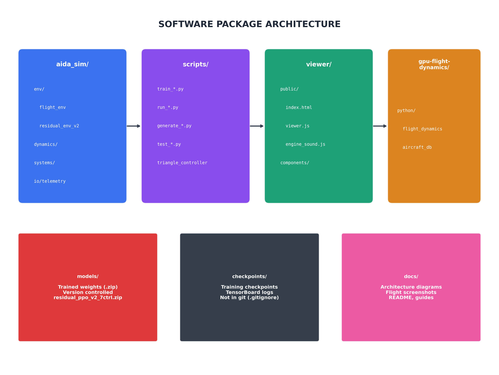
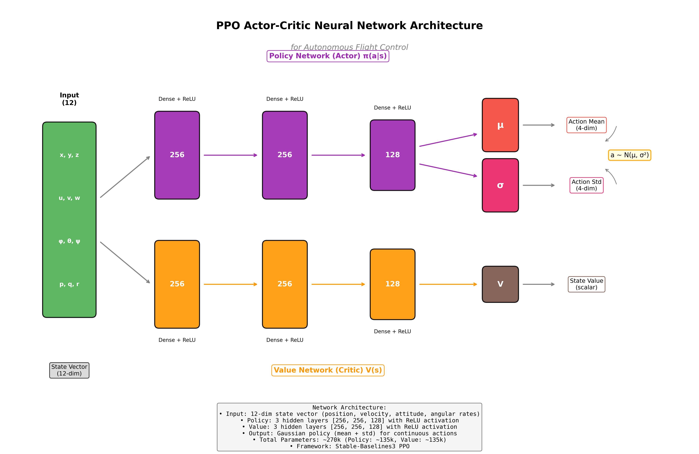

# AIDA - Autonomous Intelligent Decision Architecture

Integration of reinforcement learning and neural networks for autonomous fixed-wing aircraft control.

## Overview

AIDA is a reinforcement learning framework for training autonomous flight control policies using:
- **GPU-accelerated flight dynamics** (CUDA) for massive parallel simulation
- **Curriculum learning** for progressive skill development
- **Behavior cloning** with PPO fine-tuning for sample-efficient training
- **Real-time telemetry visualization** for monitoring and debugging

### Supported Aircraft
- **Cessna 172** - General aviation trainer (primary development platform)
- **Udaan** - Custom fixed-wing UAV

## Architecture

### Software Architecture



The system consists of six main packages:
- **Training** - PPO algorithm, curriculum learning, behavior cloning, policy networks
- **Simulation** - Gymnasium environment, GPU flight dynamics, reward shaping
- **Visualization** - TensorBoard, 3D viewer, telemetry server
- **Data & Storage** - Checkpoints, datasets, training logs
- **Aircraft Models** - Aircraft configurations, aerodynamic coefficients, 3D models
- **Configuration** - Environment parameters, training hyperparameters

### Neural Network Architecture



**Actor-Critic PPO Network:**
- **Input**: 12-dimensional state vector (position, velocity, attitude, angular rates)
- **Policy Network**: 256 → 256 → 128 neurons with ReLU, outputs Gaussian parameters (μ, σ)
- **Value Network**: 256 → 256 → 128 neurons with ReLU, outputs state value V(s)
- **Output Actions**: Throttle, aileron, elevator, rudder (continuous, normalized [-1, 1])
- **Total Parameters**: ~270k

## Quick Start

### Prerequisites
- Python 3.10+
- CUDA-capable GPU (recommended)
- WSL2 (for Windows) or Linux

### Installation

```bash
cd /home/AIDA
python3 -m venv .venv-linux
source .venv-linux/bin/activate
pip install -r requirements.txt
```

### Training

```bash
# Set environment variables (WSL)
export MPLCONFIGDIR=/tmp/matplotlib-config
export CUPY_CACHE_DIR=/tmp/cupy-cache

# Train with curriculum learning
python scripts/train_cessna172_curriculum.py --start-phase 1
```

### Visualization

```bash
# Start telemetry viewer
./scripts/utils/run_cessna172_viewer.sh

# Access:
# - 3D Viewer: http://localhost:8000
# - TensorBoard: http://localhost:6006
```

## Project Structure

```
├── aida_sim/              # Core simulation package
│   ├── env/               # RL environments (Gymnasium)
│   ├── dynamics/          # Flight physics
│   └── systems/           # Aircraft subsystems
├── assets/                # 3D models and research papers
├── checkpoints/           # Trained model weights
├── config/                # Configuration files
├── data/                  # Training data and visualizations
├── docs/                  # Documentation
├── gpu-flight-dynamics/   # CUDA parallel simulator
├── scripts/               # Training and utility scripts
└── viewer/                # 3D web visualization
```

See [PROJECT_STRUCTURE.md](PROJECT_STRUCTURE.md) for detailed layout.

## Classical Controller (Expert Demonstrator)

A fully autonomous classical controller that flies complete traffic patterns, serving as
an expert demonstrator for imitation learning and a safety fallback for hybrid architectures.

### Traffic Pattern

```
    UPWIND (N) ──────────────────► CROSSWIND TURN
         ▲                                │
         │                                ▼
      RUNWAY                         CROSSWIND (E)
         │                                │
         ▲                                ▼
    FINAL ◄────── BASE TURN ◄────── DOWNWIND TURN
         │                                │
    APPROACH                         DOWNWIND (S)
         │
      LANDING
```

### Running the Traffic Pattern Simulation

```bash
# Start the simulation with 3D viewer
cd /home/AIDA
source .venv-linux/bin/activate

# Start HTTP server for viewer (in one terminal)
cd viewer/public && python -m http.server 8000

# Start simulation (in another terminal)
python scripts/run_traffic_pattern_with_telemetry.py
```

Open browser to `http://<your-ip>:8000` for the 3D visualization.

### Viewer Controls

- **Pause/Resume**: Freeze simulation physics
- **Restart**: Reset to ground roll
- **Jump to Phase**: Skip to any flight phase
- **Follow**: Camera follows aircraft
- **Reset View**: Return to default camera position

### 15 Flight Phases

| Phase | Description |
|-------|-------------|
| GROUND_ROLL | Accelerating on runway |
| ROTATION | Pitching up for liftoff |
| INITIAL_CLIMB | Immediate post-liftoff |
| CLIMB | Climbing to cruise altitude |
| CRUISE_UPWIND | Level flight heading north |
| TURN_CROSSWIND | 90° right turn |
| CRUISE_CROSSWIND | Level flight heading east |
| TURN_DOWNWIND | 90° right turn |
| CRUISE_DOWNWIND | Level flight heading south |
| TURN_BASE | 90° right turn, begin descent |
| DESCENT_BASE | Descending on base leg |
| TURN_FINAL | Aligning with runway |
| APPROACH | Final approach with glideslope |
| LANDING | Flare and touchdown |
| LANDED | Mission complete |

### Hybrid Architecture (Future)

The classical controller enables a hybrid NN/classical architecture:

```python
if safety_monitor.is_safe(state):
    action = neural_net_policy(state)
else:
    action = classical_controller.compute_action(state)
```

## Training Methodology

### Curriculum Learning

Progressive training through flight phases:

| Phase | Task | Description | Target |
|-------|------|-------------|--------|
| 1 | Ground Roll | Accelerate on runway, maintain centerline | Reach rotation speed |
| 2 | Rotation | Pitch up to liftoff attitude | Positive climb rate |
| 3 | Initial Climb | Establish stable climb | 50 ft AGL |
| 4 | Full Climb | Climb to cruise altitude | Target altitude |
| 5 | Cruise | Level flight maintenance | Altitude/speed hold |

### Reward Shaping

Each phase uses task-specific reward functions:
- **Ground Roll**: Speed progression, centerline tracking, pitch control, heading maintenance
- **Rotation**: Pitch rate, altitude gain, airspeed maintenance
- **Climb**: Climb rate, heading, wings level
- **Cruise**: Altitude hold, speed hold, attitude stability

## Key Features

### High-Performance Simulation
- **GPU acceleration**: CuPy/CUDA for flight dynamics (1000+ parallel instances)
- **Parallel environments**: 4-16 SubprocVecEnv for PPO training
- **Real-time visualization**: WebSocket telemetry at 20Hz

### Flight Dynamics
- 6-DOF rigid body dynamics
- Aerodynamic force/moment modeling with stability derivatives
- Ground contact and friction modeling
- Configurable aircraft parameters

### Safety Constraints
- Flight envelope protection (stall speed, max speed, G-limits)
- Attitude limits (pitch, roll, yaw rate)
- Geofencing and boundary detection
- Graceful termination handling

## Development

### Environment API

```python
from aida_sim.env.flight_env_cessna172 import Cessna172Env

env = Cessna172Env(task='ground_roll')
obs, info = env.reset()

for _ in range(1000):
    action = policy(obs)  # [throttle, aileron, elevator, rudder]
    obs, reward, terminated, truncated, info = env.step(action)
    if terminated or truncated:
        break
```

### Training Scripts

```bash
# Curriculum learning (recommended)
python scripts/train_cessna172_curriculum.py --start-phase 1

# Single task training
python scripts/train_cessna172_ppo.py --task ground_roll --timesteps 500000

# Evaluation
python scripts/test_phase1_ground_roll.py --checkpoint path/to/model.zip
```

### Adding New Aircraft

1. Create aircraft configuration in `gpu-flight-dynamics/python/aircraft_database.py`
2. Add aerodynamic coefficients and mass properties
3. Create environment wrapper in `aida_sim/env/`
4. Add 3D model (GLTF) to `assets/aircraft/`

## Documentation

- [PROJECT_STRUCTURE.md](PROJECT_STRUCTURE.md) - Directory layout
- [docs/PHASE1_TRAINING_SESSION_SUMMARY.md](docs/PHASE1_TRAINING_SESSION_SUMMARY.md) - Latest training results
- [docs/session_summaries/](docs/session_summaries/) - Historical session notes
- [docs/dev/](docs/dev/) - Development documentation

## Requirements

Key dependencies (see [requirements.txt](requirements.txt)):
- `stable-baselines3` - PPO implementation
- `gymnasium` - RL environment API
- `cupy-cuda12x` - GPU-accelerated NumPy
- `torch` - Neural network training
- `tensorboard` - Training visualization

## License

Internal research project.

---

**Last Updated**: January 2, 2025
