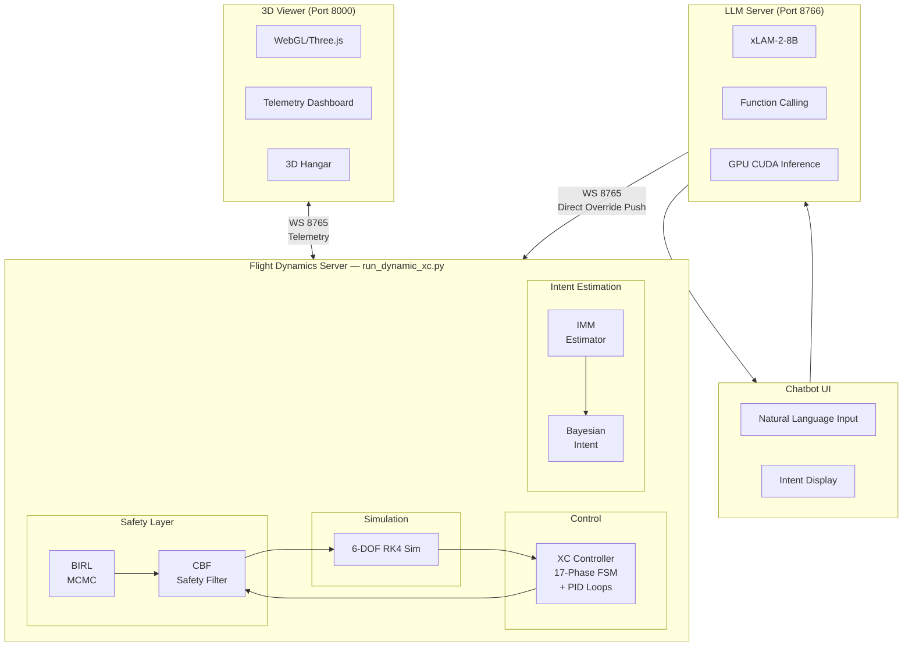
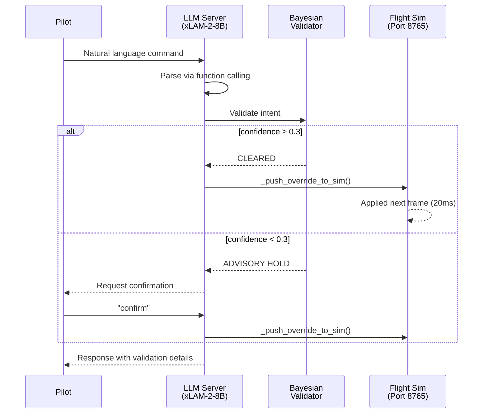
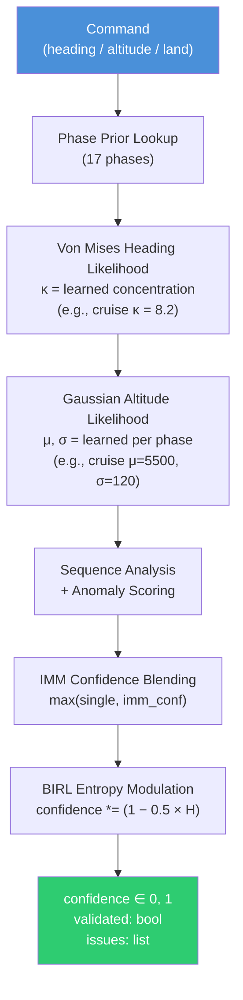
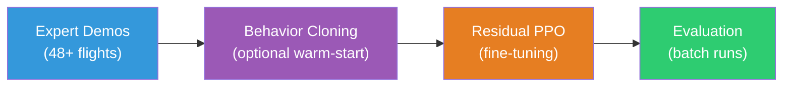

# AIDA - Autonomous Intelligent Decision Architecture

**LLM-Guided Autonomous Flight with Bayesian Intent Inference and Safety-Constrained Control**

[](#)
[](https://www.python.org/downloads/)
[](https://huggingface.co/Salesforce/xLAM-2-8b-fc-r)
[](https://developer.nvidia.com/cuda-toolkit)
[](https://docs.microsoft.com/en-us/windows/wsl/)

---

## Executive Summary

AIDA is a research framework for **LLM-guided autonomous fixed-wing aircraft flight** that combines classical control, Bayesian inference, and safety-constrained decision-making. The system demonstrates complete autonomous cross-country flights (31 NM, SN65 to KHUT) with real-time natural language pilot interaction, Bayesian intent validation, and control barrier function safety enforcement.

The core thesis contribution: an **Autonomous Copilot** architecture where a local LLM (xLAM-2-8B on GPU) acts as a conversational flight interface, while a Bayesian inference stack validates every command against learned flight priors, an IMM multi-model estimator tracks pilot intent across maneuvering modes, and entropy-modulated Control Barrier Functions enforce flight envelope protection.

### Key Capabilities

| Capability | Description |
|------------|-------------|
| **Autonomous Cross-Country Flight** | 17-phase FSM controller flies complete missions: takeoff, cruise, approach, and precision landing |
| **LLM Copilot (GPU-accelerated)** | xLAM-2-8B with function calling for natural language commands, running on RTX 4060 (~0.5s inference) |
| **Bayesian Intent Inference** | Von Mises + Gaussian posterior estimation validates commands against learned flight priors |
| **IMM Multi-Model Estimation** | 3-mode Interacting Multiple Model estimator (tracking/maneuvering/anomalous) with Markov transitions |
| **BIRL Reward Inference** | Bayesian Inverse Reinforcement Learning infers pilot reward weights via MCMC |
| **Control Barrier Functions** | 6 entropy-modulated barriers enforce flight envelope (altitude, airspeed, bank, pitch) |
| **Advisory Hold System** | Low-confidence commands (< 30%) held for pilot confirmation before execution |
| **Route Recalculation** | Mid-flight diversions with full approach recalculation from any position |
| **6-DOF GPU Simulation** | CUDA-accelerated RK4 flight dynamics, 577M steps/sec on RTX 4060 |

---

## Table of Contents

1. [Quick Start](#quick-start)
2. [System Architecture](#system-architecture)
3. [LLM Flight Copilot](#llm-flight-copilot)
4. [Bayesian Intent Inference](#bayesian-intent-inference)
5. [IMM Multi-Model Estimator](#imm-multi-model-estimator)
6. [BIRL Reward Inference](#birl-reward-inference)
7. [Control Barrier Functions](#control-barrier-functions)
8. [Flight Controller](#flight-controller)
9. [6-DOF Flight Dynamics](#6-dof-flight-dynamics)
10. [Neural Network Training](#neural-network-training)
11. [3D Viewer & Telemetry](#3d-viewer--telemetry)
12. [Project Structure](#project-structure)
13. [References](#references)

---

## Quick Start

### Prerequisites

- **OS**: Windows 11 with WSL2 (Ubuntu 22.04) or native Linux
- **Python**: 3.10+
- **GPU**: NVIDIA RTX 4060+ (8GB VRAM) for LLM inference and CUDA simulation
- **RAM**: 16+ GB recommended
- **Disk**: ~10 GB (including LLM model and training data)

### Installation

```bash
# In WSL2 Ubuntu terminal
cd /home
git clone <repository-url> AIDA
cd AIDA

# Create virtual environment
python3 -m venv .venv-linux
source .venv-linux/bin/activate

# Install dependencies
pip install --upgrade pip
pip install -r requirements.txt

# Install llama-cpp-python with CUDA support (for GPU LLM inference)
CMAKE_ARGS='-DGGML_CUDA=on' CUDA_PATH=/usr/local/cuda \
    pip install llama-cpp-python --force-reinstall --no-cache-dir

# Download LLM model (4.9 GB)
mkdir -p llm/models && cd llm/models
wget https://huggingface.co/bartowski/Llama-xLAM-2-8B-fc-r-GGUF/resolve/main/Llama-xLAM-2-8B-fc-r-Q4_K_M.gguf
cd ../..
```

### Running

```bash
# Option A: All-in-one (recommended)
./start_aida.sh

# Option B: Manual (three terminals)
# Terminal 1: HTTP viewer
cd viewer/public && python3 -m http.server 8000

# Terminal 2: Flight dynamics (4x speed)
source .venv-linux/bin/activate
python scripts/run_dynamic_xc.py --speed 4

# Terminal 3: LLM command server
source .venv-linux/bin/activate
python llm/llm_command_server.py
```

Open `http://localhost:8000` in your browser. Select an aircraft in the 3D hangar, choose origin/destination, and click "Start Flight".

### Stopping

```bash
./stop_aida.sh
```

---

## System Architecture

AIDA operates as a multi-layer autonomous copilot system with three real-time WebSocket connections:



### Component Overview

| Layer | Component | Purpose |
|-------|-----------|---------|
| **Perception** | IMM Estimator | 3-mode hypothesis tracking (tracking/maneuvering/anomalous) |
| **Inference** | Bayesian Intent | Von Mises + Gaussian posterior validation per phase |
| **Learning** | BIRL Engine | MCMC-based reward weight inference from observations |
| **Safety** | CBF Layer | 6 entropy-modulated barrier functions with QP solver |
| **Control** | XC Controller | 17-phase FSM with PID loops for all flight phases |
| **Interface** | LLM Copilot | xLAM-2-8B with function calling, GPU-accelerated |
| **Simulation** | 6-DOF Dynamics | CUDA RK4 integrator, 577M steps/sec |
| **Visualization** | 3D Viewer | WebGL with Three.js, real-time telemetry dashboard |

### Data Flow

1. **Command Path**: Pilot text → LLM parse → Bayesian validation → Advisory hold (if low confidence) → Override push → Controller
2. **Safety Path**: Controller output → BIRL feature extraction → CBF safety filter → Actuator commands → Dynamics
3. **Telemetry Path**: Dynamics state → Telemetry broadcast (50 Hz) → Viewer + LLM server state update

---

## LLM Flight Copilot

### Model: xLAM-2-8B (Salesforce)

AIDA uses **Llama-xLAM-2-8B-fc-r** (Q4_K_M quantization, 4.9 GB), a function-calling optimized LLM based on Llama 3.1 architecture. The model runs entirely on the local GPU (RTX 4060, 8 GB VRAM) with all 33 transformer layers offloaded via llama-cpp-python with CUDA backend.

| Specification | Value |
|---------------|-------|
| Model | Llama-xLAM-2-8B-fc-r-Q4_K_M.gguf |
| Parameters | 8B (4-bit quantized) |
| Context | 4,096 tokens |
| VRAM Usage | ~4.4 GB model + 0.5 GB KV cache |
| Prompt Eval | ~65 tokens/sec (GPU) |
| Generation | ~13 tokens/sec (GPU) |
| Inference Time | ~0.5 seconds per command |

### Supported Commands

| Command Type | Examples | Tool Called |
|--------------|----------|------------|
| Heading | "turn to heading 270", "fly 090" | `set_heading` |
| Altitude | "climb to 7000", "descend 4000 ft" | `set_altitude` |
| Landing | "land at KHUT", "divert to KICT" | `land_at_airport` |
| Return to Cruise | "return to cruise altitude" | `return_to_cruise` |
| Status | "sitrep", "brief me", "status" | `get_status` |
| Nearest Airport | "nearest airport", "where can I land" | `get_nearest_airport` |
| ETA | "how long", "time to destination" | `calculate_time_to_destination` |
| Top of Descent | "when to descend", "TOD" | `calculate_top_of_descent` |
| Distance | "how far to KICT" | `get_distance_to_airport` |
| Situation Report | "give me a full sitrep" | `get_situation_report` |
| Conversation | "what's the stall speed?", "spin recovery" | Natural response |

### Override Pipeline

The LLM server pushes overrides **directly** to the sim via the telemetry WebSocket (port 8765), bypassing the browser relay for minimal latency:



### Flight Context

The LLM receives real-time flight context (altitude, heading, airspeed, phase, distance, origin, destination) via a telemetry listener connected to port 8765. This enables context-aware responses like "You're 12.3 nm from KHUT at 5,500 ft, ETA 6 minutes."

---

## Bayesian Intent Inference

**File**: `llm/bayesian_intent.py` (1,351 lines)

The Bayesian intent inference engine validates every flight command against **learned phase-specific priors** derived from 48+ training flights (186,000+ observations).

### Architecture



### Learned Priors

Priors are learned from training data via `llm/intent_learning.py` and stored in `data/intent_observations/`. Each flight phase has:

- **Heading**: Von Mises distribution (κ = concentration parameter)
- **Altitude**: Gaussian distribution (μ, σ)
- **Airspeed**: Gaussian distribution (μ, σ)

Example learned priors:

| Phase | Heading κ | Altitude μ (ft) | Altitude σ (ft) | Observations |
|-------|-----------|------------------|------------------|--------------|
| Cruise | 8.2 | 5,500 | 120 | 42,000+ |
| Climb | 3.1 | 3,200 | 850 | 18,000+ |
| Final Approach | 12.5 | 1,800 | 200 | 8,000+ |
| Ground Roll | 25.0 | 0 | 10 | 6,000+ |

### Advisory Hold System

When Bayesian confidence drops below 30% (e.g., commanding heading 180 when flying toward KHUT on heading 090), the command is **held** with a human-readable assessment:

```
Advisory: Heading 180 diverges from KHUT (direct heading 087, 15.2 nm away).
Large heading change (93 degrees from current 087). Say 'confirm' to proceed.
```

---

## IMM Multi-Model Estimator

**File**: `llm/imm_estimator.py` (431 lines)

The Interacting Multiple Model (IMM) estimator runs 3 parallel mode hypotheses with Bayesian model probability updates, providing robust confidence estimation during maneuvering phases.

### Three Modes

| Mode | Description | Noise Scale | Confidence Weight |
|------|-------------|-------------|-------------------|
| **Tracking** | Steady, predictable flight | Low (1.0) | 1.0 |
| **Maneuvering** | Active turns, altitude changes | Medium (3.0) | 0.7 |
| **Anomalous** | Erratic, unexpected behavior | High (8.0) | 0.05 |

### Markov Transition Matrix

```
         To:  Track  Maneuver  Anomalous
From:
Track     [  0.90    0.08      0.02  ]
Maneuver  [  0.15    0.80      0.05  ]
Anomalous [  0.05    0.10      0.85  ]
```

### 16 Phase-Specific Configurations

Each flight phase has tuned noise parameters for all 3 modes. Example:

| Phase | Heading κ (track/maneuver/anomalous) | Altitude σ (track/maneuver/anomalous) |
|-------|--------------------------------------|---------------------------------------|
| Cruise | 10.0 / 2.0 / 0.3 | 50 / 200 / 800 |
| Turn to Intercept | 2.0 / 0.8 / 0.2 | 100 / 300 / 800 |
| Final Approach | 15.0 / 3.0 / 0.5 | 30 / 150 / 500 |

### Phase Transition Handling

On phase change, mode noise parameters are swapped but **state estimates are preserved**, preventing residual spikes at phase boundaries. This was critical for maintaining clean 0.988 confidence across all phases.

### Confidence Formula

```
confidence = P(tracking) × 1.0 + P(maneuvering) × 0.7 + P(anomalous) × 0.05
```

Blended with single-model confidence via `max(single_conf, imm_conf)`, allowing the IMM to "rescue" maneuvering phases where single-model priors are too tight.

---

## BIRL Reward Inference

**File**: `llm/birl_inference.py` (345 lines)

Bayesian Inverse Reinforcement Learning (BIRL) infers the pilot/agent's reward weights from observed behavior using Metropolis-Hastings MCMC.

### Feature Space (4 dimensions)

| Feature | Description | Computation |
|---------|-------------|-------------|
| **Trajectory Tracking** | Deviation from commanded state | Normalized altitude/heading/speed error |
| **Safety** | Margin from envelope boundaries | Min normalized margin (altitude, airspeed) |
| **Comfort** | Load factor smoothness | 1 - \|load_factor - 1\| / 2 |
| **Effort** | Control input magnitude | 1 - RMS(aileron, elevator, rudder) / √3 |

### MCMC Parameters

| Parameter | Value |
|-----------|-------|
| Samples | 200 |
| Burn-in | 50 |
| Step size | 0.1 |
| Boltzmann temperature (β) | 5.0 |
| Observation buffer | 500 (ring buffer) |
| Update rate | Every 50 frames (1 Hz) |

### Entropy Output

BIRL entropy H ∈ [0, 1] measures **ambiguity in inferred intent**:
- H < 0.3: Clear intent (e.g., steady cruise toward destination)
- H ∈ [0.3, 0.7]: Moderate ambiguity (e.g., maneuvering phase)
- H > 0.7: High ambiguity (e.g., erratic commands, uncertain intent)

Entropy feeds into both the Bayesian confidence modulation and the CBF safety margin.

---

## Control Barrier Functions

**File**: `llm/cbf_safety.py` (498 lines)

Six entropy-modulated Control Barrier Functions enforce the flight envelope as a QP-constrained safety layer between the controller and the dynamics.

### 6 Barrier Functions

| # | Barrier | h(x) ≥ 0 | Entropy Effect |
|---|---------|-----------|----------------|
| 1 | Altitude floor | alt - 200ft + η(1-H) | Raises floor when uncertain |
| 2 | Altitude ceiling | 14000ft - alt + η(1-H) | Lowers ceiling when uncertain |
| 3 | Stall speed | V - Vs + η(1-H)×5 | Increases stall margin when uncertain |
| 4 | Overspeed | Vne - V + η(1-H)×5 | Reduces max speed when uncertain |
| 5 | Bank angle | 45° - \|φ\| + η(1-H)×0.1 | Tightens bank limit when uncertain |
| 6 | Pitch limits | Quadratic in θ | Contracts pitch range when uncertain |

### Entropy Modulation

```
h_AIDA(x) = h_nominal(x) + η × (1 - H_BIRL)
```

When BIRL entropy is high (H → 1), the safety margins **contract** (more conservative). When intent is clear (H → 0), margins relax to nominal values.

### QP Solver

```
minimize  ||u - u_desired||²
subject to  ḣᵢ + α × hᵢ ≥ 0   for each active barrier
            u ∈ [u_min, u_max]   actuator limits
```

Solved via `scipy.optimize.minimize(method='SLSQP', maxiter=20)` with a clamp-based fallback if the QP fails.

### Phase Exclusions

CBF is disabled during ground operations (GROUND_ROLL, ROTATION, INITIAL_CLIMB) and terminal phases (SHORT_FINAL, FLARE, ROLLOUT, LANDING, LANDED) where the controller needs unrestricted authority.

---

## Flight Controller

**File**: `scripts/generalized_xc_controller.py`

A 17-phase Finite State Machine (FSM) controller with PID loops handles the complete cross-country flight profile.

### 17 Flight Phases


| Phase | Description | Key Control |
|-------|-------------|-------------|
| GROUND_ROLL | Accelerate on runway | Full throttle, rudder steering |
| ROTATION | Pitch up at V_rotate (54 KTAS) | Elevator pull-up |
| INITIAL_CLIMB | Clear obstacles | V_climb = 74 KTAS, wings level |
| CLIMB | Climb to cruise altitude | 500 fpm, track to turn point |
| CRUISE_TO_TP | Level cruise | 5,500 ft, 110 KTAS, heading hold |
| TURN_TO_INTERCEPT | Procedure turn | Bank to intercept heading |
| INTERCEPT_LEG | Track to final approach | Descend to pattern altitude |
| FINAL_APPROACH | Stabilized approach | 3° glideslope, 65 KTAS |
| SHORT_FINAL | Pre-landing config | Full flaps, 60 KTAS |
| FLARE | Landing flare | Idle thrust, pitch up |
| ROLLOUT | Ground deceleration | Brakes, nose steering |
| LANDING | Speed below 5 KTAS | Full brakes |
| LANDED | Mission complete | Overrides cleared |

Additional phases: GROUND (pre-takeoff), MISSED_APPROACH, HOLD, GO_AROUND, TAXI.

### LLM Override System

The controller supports real-time overrides from the LLM:

- **`set_heading_override(hdg)`**: Overrides cruise heading target
- **`set_altitude_override(alt)`**: Overrides cruise altitude target
- **`set_land_override(target)`**: Triggers `recalculate_approach()` from current position

### Route Recalculation

After a diversion (e.g., heading 180° away from destination), the `recalculate_approach()` method:

1. Computes bearing from current position to destination
2. Calculates new turn point and intercept geometry
3. Sets appropriate phase (CRUISE_TO_TP, TURN_TO_INTERCEPT, or FINAL_APPROACH)
4. Flight continues autonomously to landing

Terminal phase guard prevents recalculation during SHORT_FINAL/FLARE/ROLLOUT/LANDING/LANDED.

---

## 6-DOF Flight Dynamics

**Files**: `gpu-flight-dynamics/` (CUDA), `aida_sim/dynamics/` (Python)

### CUDA-Accelerated Simulator

The flight dynamics engine uses a 4th-order Runge-Kutta (RK4) integrator with a complete aerodynamic model running on the GPU.

| Specification | Value |
|---------------|-------|
| State vector | 12 dimensions [x, y, z, u, v, w, φ, θ, ψ, p, q, r] |
| Control inputs | 7 [throttle, aileron, elevator, rudder, flaps, spoilers, brakes] |
| Integration | RK4, dt = 0.02s |
| GPU throughput | 577M steps/sec (RTX 4060) |
| Parallel instances | Up to 10,000 |

### 12-State Continuous MDP

```
State x = [x, y, z, u, v, w, φ, θ, ψ, p, q, r]
          position  velocity  attitude  rates
          (NED)     (body)    (Euler)   (body)

Action u = [δt, δa, δe, δr, δf, δs, δb]
           throttle aileron elevator rudder flaps spoilers brakes
```

### Aerodynamic Model

Based on Stevens & Lewis with Cessna 172 coefficients:
- Lift: CL(α, δf, q) with stall model
- Drag: CD(CL, δf) parabolic polar
- Side force: CY(β, δr, p, r)
- Moments: Cl, Cm, Cn functions of α, β, control surfaces, and rates

### Earth Model

Spherical Earth model with curvature corrections for navigation:
- WGS-84 reference ellipsoid
- NED to lat/lon/alt conversion
- Curvature altitude correction for long cross-country flights

---

## Neural Network Training

### Training Pipeline



### Residual RL Architecture

The Residual RL approach learns **corrections** to the expert controller:

```
u_total = u_expert + λ × δ_nn
```

| Component | Specification |
|-----------|---------------|
| Input | 25 dimensions (state + expert + target + phase) |
| Hidden | 512 → 512 → 256 (ReLU) |
| Output | 7 dimensions (Tanh → scaled residuals) |
| Parameters | ~411,000 |

### Observation Space (25 dimensions)

```
[x, y, z, u, v, w, φ, θ, ψ, p, q, r,     # 12: aircraft state
 δt, δa, δe, δr, δf, δs, δb,               # 7: expert action
 heading_error, distance, altitude_error,    # 3: navigation target
 is_takeoff, is_cruise, is_approach]         # 3: phase one-hot
```

### PPO Hyperparameters

| Parameter | Value |
|-----------|-------|
| Learning rate | 1e-4 |
| Rollout steps | 4,096 |
| Batch size | 256 |
| Epochs per update | 10 |
| Discount (γ) | 0.995 |
| Clip range | 0.1 |

### Intent Training Pipeline

**File**: `llm/intent_training_pipeline.py` (1,985 lines)

Batch flight simulation pipeline that:
1. Runs 48+ autonomous flights with varied conditions
2. Collects intent observations at every frame
3. Learns phase-specific priors (Von Mises κ, Gaussian μ/σ)
4. Validates Bayesian inference against ground truth
5. Exports learned priors for the live system

---

## 3D Viewer & Telemetry

### WebGL Viewer

**File**: `viewer/public/index.html`

Real-time 3D visualization built with Three.js:

- **3D Hangar Mode**: Interactive aircraft selection with ambient lighting
- **Flight Mode**: Full PFD (Primary Flight Display) with:
  - Attitude indicator (artificial horizon)
  - Heading tape / compass
  - Altitude tape with VSI
  - Airspeed indicator
  - Phase indicator
  - Bayesian confidence display
  - IMM mode probabilities
- **Telemetry Dashboard**: Position, velocity (body-frame u/v/w), angular rates, control surfaces, AoA, sideslip
- **Agent Indicator**: Shows "AUTONOMOUS COPILOT" mode and actual simulation speed

### Chatbot Interface

**File**: `viewer/public/chatbot.js`

In-browser chat panel for LLM interaction:
- Natural language command input
- Pilot-style responses from AIDA
- Intent validation display (confidence %, CLEARED/ADVISORY/REJECTED)
- BIRL entropy and CBF status indicators
- Quick-command buttons (Status, HDG 270, ALT 7000, Land KHUT)

### Telemetry Protocol

WebSocket on port 8765, JSON at 50 Hz:

```json
{
  "position": [x_ft, y_ft, z_ft],
  "quaternion": [w, x, y, z],
  "velocity": [u_fps, v_fps, w_fps],
  "velocity_ned": [vn_fps, ve_fps, vu_fps],
  "rates": [p, q, r],
  "altitude_ft": 5500.0,
  "airspeed_kts": 110.0,
  "heading_deg": 87.3,
  "phase": "CRUISE_TO_TP",
  "sim_speed": 4.0,
  "pilot_mode": "Autonomous Copilot",
  "imm_confidence": 0.988,
  "imm_dominant": "tracking",
  "cbf_active": false,
  "birl_weights": [0.45, 0.30, 0.15, 0.10]
}
```

---

## Project Structure

```
AIDA/
├── aida_sim/                        # Core simulation package
│   ├── control/                     # PID controllers, autopilot
│   ├── dynamics/                    # Flight physics (forces, integrator, state)
│   ├── env/                         # Gymnasium RL environments
│   ├── guidance/                    # Pure pursuit, vector field guidance
│   ├── io/                          # Telemetry WebSocket server
│   ├── models/                      # Unified transformer architecture
│   ├── planning/                    # Mission planner
│   ├── platform/                    # Airports, ground model, world
│   ├── safety/                      # Safety guards
│   ├── scenarios/                   # Flight scenarios
│   ├── systems/                     # Aircraft subsystems (battery)
│   └── trajectory/                  # Dubins paths, route planning
│
├── llm/                             # LLM + Bayesian Intelligence Layer
│   ├── llm_command_server.py        # WebSocket server (8766), LLM + override pipeline
│   ├── bayesian_intent.py           # Von Mises + Gaussian Bayesian validation
│   ├── imm_estimator.py             # Interacting Multiple Model estimator
│   ├── birl_inference.py            # Bayesian IRL with MCMC
│   ├── cbf_safety.py                # Control Barrier Functions (QP solver)
│   ├── intent_learning.py           # Learn priors from training data
│   ├── intent_training_pipeline.py  # Batch flight simulation for training
│   ├── intent_validator.py          # Heuristic intent validation
│   ├── intent_bridge.py             # Bridge between old/new validation
│   ├── flight_intent.py             # Intent data structures
│   └── models/                      # LLM model weights (GGUF)
│       └── Llama-xLAM-2-8B-fc-r-Q4_K_M.gguf
│
├── scripts/                         # Flight and training scripts
│   ├── run_dynamic_xc.py            # Main flight dynamics server
│   ├── generalized_xc_controller.py # 17-phase FSM controller
│   ├── earth_model.py               # WGS-84 Earth model
│   ├── train_residual_ppo_v2.py     # Residual RL training
│   ├── residual_env_v2.py           # Residual RL environment
│   └── ...                          # Other training/test scripts
│
├── gpu-flight-dynamics/             # CUDA-accelerated 6-DOF simulator
│   ├── cuda/                        # CUDA C++ source
│   └── python/                      # Python bindings
│       ├── flight_dynamics.py       # FlightSimulator class
│       └── aircraft_database.py     # Aircraft configurations
│
├── viewer/                          # 3D WebGL visualization
│   └── public/
│       ├── index.html               # Main viewer (PFD, hangar, telemetry)
│       ├── chatbot.js               # LLM chatbot interface
│       ├── chatbot.css              # Chatbot styling
│       └── engine_sound.js          # Engine audio
│
├── data/                            # Training data and observations
│   ├── intent_observations/         # Bayesian intent training data
│   ├── learned_priors/              # Learned phase priors
│   └── cbf_metrics/                 # CBF intervention logs
│
├── models/                          # Trained NN model weights
├── checkpoints/                     # Training checkpoints
├── docs/                            # Documentation and diagrams
│   ├── img/                         # Screenshots
│   └── session_summaries/           # Training session records
│
├── start_aida.sh                    # Start all servers
├── stop_aida.sh                     # Stop all servers
├── requirements.txt                 # Python dependencies
└── README.md                        # This file
```

---

## Available Airports

| ICAO | Name | Elevation | Location |
|------|------|-----------|----------|
| SN65 | Lake Waltanna Airport | 1,448 ft | 38.08°N, 98.12°W |
| KHUT | Hutchinson Regional Airport | 1,542 ft | 38.07°N, 97.86°W |
| KICT | Wichita Eisenhower National | 1,333 ft | 37.65°N, 97.43°W |
| KAAO | Colonel James Jabara Airport | 1,421 ft | 37.75°N, 97.22°W |
| K50K | Pawnee Municipal Airport | 2,200 ft | 37.83°N, 99.34°W |

---

## Thesis Claims Status

| # | Claim | Status | Details |
|---|-------|--------|---------|
| Ch1 | 12-state continuous MDP | Implemented | x=[x,y,z,u,v,w,φ,θ,ψ,p,q,r], 7 controls |
| Ch2 | Expert FSM controller (17 phases) | Implemented | Full XC with precision landing |
| Ch2 | Residual RL (PPO + expert corrections) | Implemented | λ-scaled neural corrections |
| Ch3 | Bayesian intent inference (Von Mises) | Implemented | Learned priors from 186K+ observations |
| Ch3 | BIRL reward weight inference | Implemented | 4-feature MCMC, 200 samples |
| Ch4 | Von Mises directional filter | Implemented | Phase-specific heading concentration |
| Ch4 | IMM multi-model estimation | Implemented | 3 modes, 16 phases, Markov TPM |
| Ch5 | Entropy-modulated CBF | Implemented | 6 barriers, η=0.3, SLSQP QP |
| Ch6 | Custom 6-DOF sim (RK4) | Implemented | CUDA, 577M steps/sec |
| Ch6 | GPU parallel simulation | Implemented | Up to 10K instances |
| -- | LLM copilot interface | Implemented | xLAM-2-8B, GPU, 0.5s inference |
| -- | Advisory hold system | Implemented | 30% threshold, pilot confirm |
| -- | Route recalculation | Implemented | Mid-flight diversion + return |
| -- | Real-time 3D viewer | Implemented | WebGL, 50 Hz telemetry |

---

## References

1. **xLAM-2-8B**: Zhang et al., "xLAM: A Family of Large Action Models for AI Agents", Salesforce AI Research, 2024
2. **llama-cpp-python**: [github.com/abetlen/llama-cpp-python](https://github.com/abetlen/llama-cpp-python)
3. **IMM Estimator**: Blom & Bar-Shalom, "The Interacting Multiple Model Algorithm for Systems with Markovian Switching Coefficients", IEEE TAC, 1988
4. **BIRL**: Ramachandran & Amir, "Bayesian Inverse Reinforcement Learning", IJCAI 2007
5. **Control Barrier Functions**: Ames et al., "Control Barrier Functions: Theory and Applications", ECC 2019
6. **Von Mises Distribution**: Mardia & Jupp, "Directional Statistics", Wiley, 2000
7. **Flight Dynamics**: Stevens, Lewis & Johnson, "Aircraft Control and Simulation" (3rd ed.), Wiley, 2015
8. **PPO**: Schulman et al., "Proximal Policy Optimization Algorithms", arXiv:1707.06347, 2017
9. **Residual RL**: Silver et al., "Residual Policy Learning", arXiv:1812.06298, 2018

---

## License

Internal research project - Kushal Koirala

---

## Version History

| Version | Date | Highlights |
|---------|------|------------|
| **A.3** | Feb 1, 2026 | IMM estimator, CUDA LLM inference, direct override push, velocity telemetry fix |
| **A.2** | Jan 31, 2026 | BIRL+CBF safety layer, advisory hold, route recalculation, intent training pipeline |
| **A.1** | Jan 18, 2026 | Bayesian intent inference, learned priors, 3D hangar, xLAM-2-8B LLM |
| **A.0** | Jan 2026 | Initial release: autonomous XC flight, expert FSM, 3D viewer |

---

**Last Updated**: February 1, 2026
